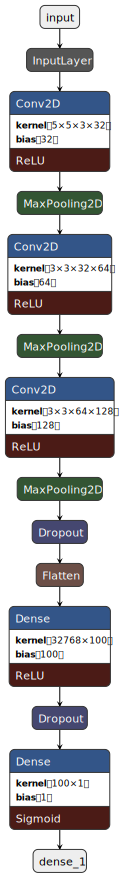

# COVID19-Mask-Detector
Developed a face mask detector with 99% accuracy. It can automatically detect whether people in the image are wearing masks or not.

## Table of Content
* [Overview](https://github.com/digvijaysingh2000/Computer-Vision#overview)
* [Motivation](https://github.com/digvijaysingh2000/Computer-Vision#motivation)
* [Libraries used](https://github.com/digvijaysingh2000/Computer-Vision#libraries-used)
* [Generating the Training Data](https://github.com/digvijaysingh2000/Computer-Vision#generating-the-training-data)
* [Model](https://github.com/digvijaysingh2000/Computer-Vision#model)
* [Model Visualization](https://github.com/digvijaysingh2000/Computer-Vision#model-visualization)
* [Results](https://github.com/digvijaysingh2000/Computer-Vision#results)
* [Impact and Future Scope](https://github.com/digvijaysingh2000/Computer-Vision#impact-and-future-scope)
* [Team](https://github.com/digvijaysingh2000/Computer-Vision#team)

## Overview
* In Covid 19 Mask Detector we used OpenCV, Tensorflow/Keras, and Deep Learning.
* It can automatically detect whether people in the image are wearing masks or not.
* Our goal is to train a custom deep learning model to detect whether people in the image are wearing a mask or not.

## Motivation
* In these difficult times of pandemic, there is a growing need to wear a mask.
* But many people have started neglecting the necessity of a mask.
* A mask not only protects the wearer, but also stops the transmission of the deadly virus.
* So, our model will help us to keep a check on the people whether they are wearing a mask or not.

## Libraries used
* OpenCV
* Tensorflow/Keras
* Pandas
* Numpy
* Matplotlib

## Generating the Training Data
* Imported the dataset, and retained only those images with a classname either 'face_with_mask' or 'face_without_mask'.
* Generated the training and testing sets of unique images.
* Created a new column containing the coordinates of bounding box(es), and wrote a function to draw them.
* Constructed the final training data by cropping it to the bounding boxes.
* Normalized the training data before feeding in the model.

## Model
|        Name        |        Value        |
| :----------------: | :----------------:  |
| Optimizer          | Adam                |
| Learning rate      | 0.001               |
| Epsilon            | 0.01                |
| β1                 | 0.9                 |
| β2                 | 0.999               |
| Epochs             | 40                  |
| Batch size         | 32                  |
| Dropout            | 0.25, 0.5           |
| Activation Function| ReLu                |
| Loss Function      | Binary Cross Entropy|

* [Adam Optimizer](https://github.com/digvijaysingh2000/Computer-Vision/blob/main/Adam.md)
* [MTCNN](https://github.com/digvijaysingh2000/Computer-Vision/blob/main/MTCNN.md)

## Model Visualization

  

## Results
The final accuracy obtained by the model was 99.38% on the training data with a loss of 0.0200.  

  

## Impact and Future Scope
* Our model can be used to keep a check on people, whether they are obeying the pandemic guidelines or not, in crowded areas.
* It can be improved to use in CCTV cameras by adding a video feature.
